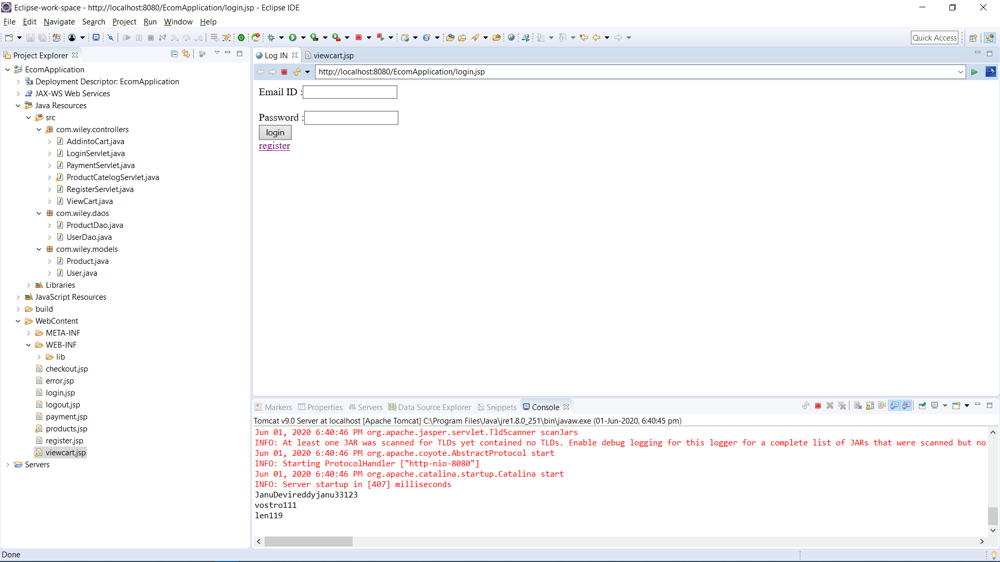
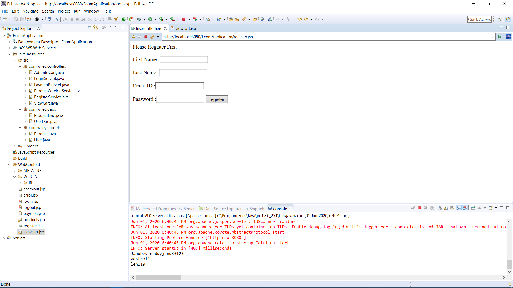
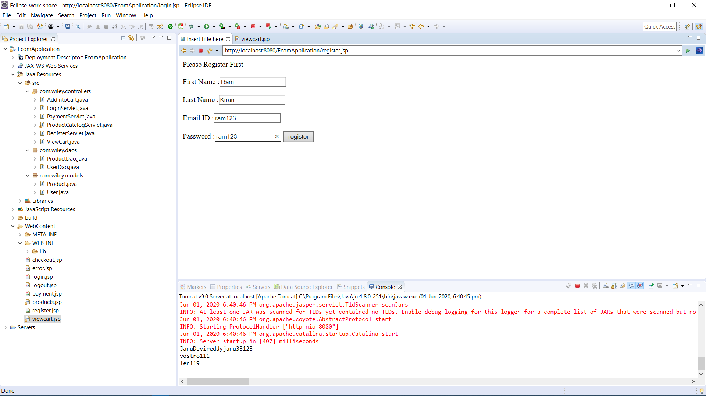
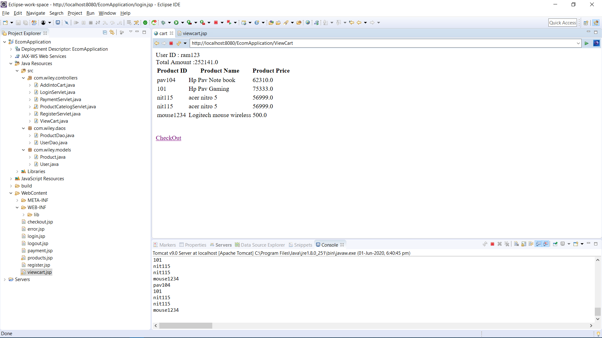
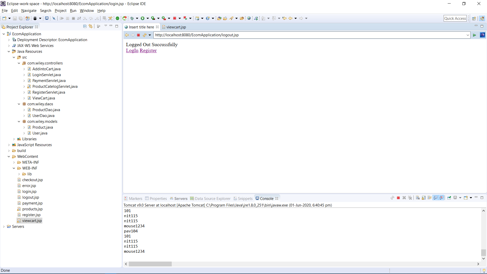

# Ecommerce-ApplicationUsing-JSPs-and-Servlets

Outputs in Order:
Link : http://localhost:8080/EcomApplication/login.jsp
After starting the server and going to this link	

If username is not present in the database redirect to register.jsp
 

fill out the details

After registering redirect to login.jsp

After login show user id , number of items in cart and products

If add to cart is clicked 

-...

When View cart is clicked

When checkout is clicked payments options are visible

  
After payment

When continue is clicked after payment go to products.jsp

 
When logout is clicked 
 

